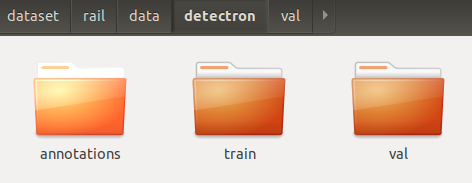
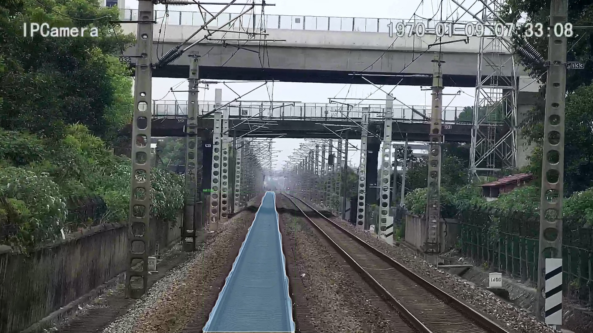
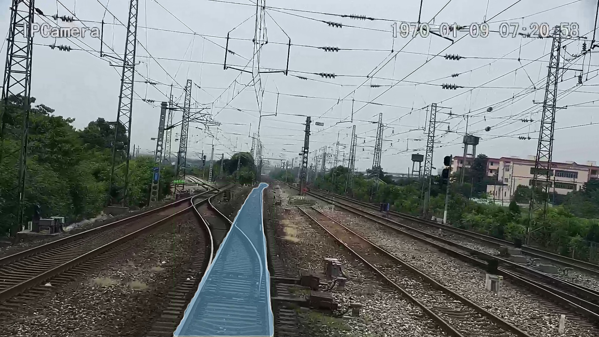
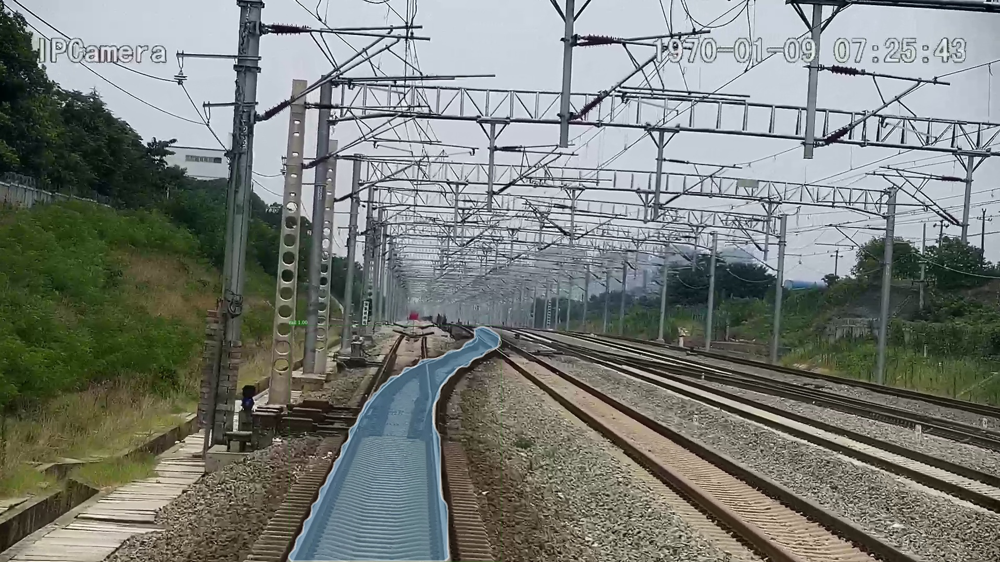
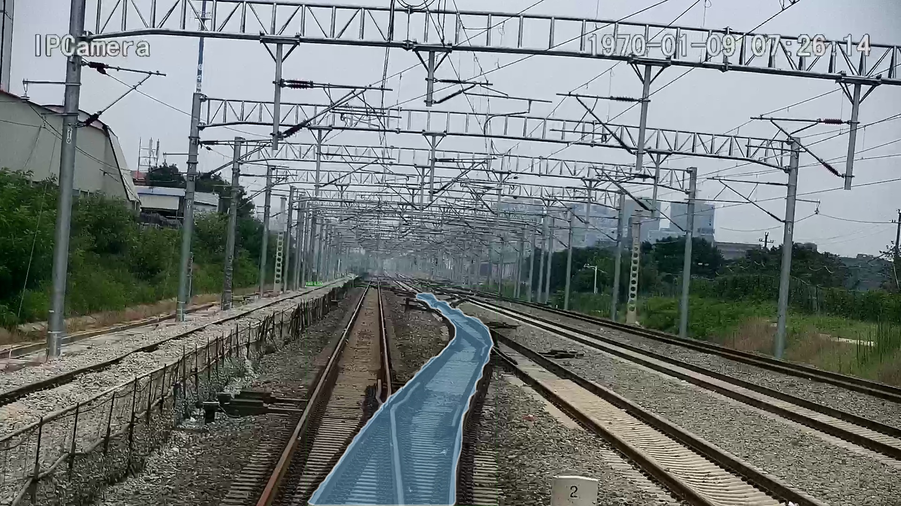

# 使用Detectron进行Mask R-CNN训练和预测

Detectron是FAIR的目标检测研究平台,实现了当下最好的算法,比如: Faster R-CNN, REtina
Net, Mask R-CNN等. 项目Github地址为:[Detectron](https://github.com/facebookresearch/Detectron)


## 一、Detectron的安装

默认大家已经安装成功了CUDA和cuDNN, 我本机安装的CUDA版本为9.0, cuDNN版本为7.2,仅做参考

### 1. Caffe2的安装

caffe2之前不支持Anaconda环境安装,所以只能通过编译源码进行安装,导致很多人安装了数天都没有安装成功,但是现在caffe2支持Anaconda进行安装,大大降低了caffe2的使用成本.官方安装链接:[installation](https://caffe2.ai/docs/getting-started.html?platform=ubuntu&configuration=prebuilt)

GPU版本,安装过Anaconda, CUDA9以及cuDNN7的电脑,可以直接通过以下命令进行caffe2的安装:

```python
conda install pytorch-nightly -c pytorch
```

CUDA8以及cuDNN7的电脑可以通过以下命令进行caffe2的安装:

```python
conda install pytorch-nightly cuda80 -c pytorch
```

官方建议使用conda虚拟环境进行安装,但是caffe2使用虚拟环境安装成功后,在后边继续detectron安装时  ,出现了大量的导包以及镜像无法找到错误,反倒是直接安装caffe2没有出现任何问题,所以利弊请自己权衡.

caffe2通过Anaconda安装完成后,请使用以下方式验证是否安装成功:

```
# To check if Caffe2 build was successful
python -c 'from caffe2.python import core' 2>/dev/null && echo "Success" || echo "Failure"

# To check if Caffe2 GPU build was successful
# This must print a number > 0 in order to use Detectron
python -c 'from caffe2.python import workspace; print(workspace.NumCudaDevices())'
```

### 2. COCO API的安装

请安装以下步骤安装COCO API:

```
# COCOAPI=/path/to/clone/cocoapi
git clone https://github.com/cocodataset/cocoapi.git $COCOAPI
cd $COCOAPI/PythonAPI
# Install into global site-packages
make install
# Alternatively, if you do not have permissions or prefer
# not to install the COCO API into global site-packages
python setup.py install --user
```

其中COCOAPI这个环境变量需要在家目录下的.bashrc文件中指定好,不要忘记编辑完成该文件后source一下.

### 3.Detectron的安装

克隆Detectron仓库:

```
# DETECTRON=/path/to/clone/detectron
git clone https://github.com/facebookresearch/detectron $DETECTRON
```

安装Python相关依赖:

```
pip install -r $DETECTRON/requirements.txt
```

编译:

```
cd $DETECTRON && make
```

检查Detectron测试是否通过:

```
python $DETECTRON/detectron/tests/test_spatial_narrow_as_op.py
```

安装完成之后,可以先体验一把Detectron: [getting_started](https://github.com/facebookresearch/Detectron/blob/master/GETTING_STARTED.md)


## 二、COCO格式数据集的制作

1. 在本机创建一个新文件夹,并在该文件夹下新建annotations, train和val三个文件夹



2. 将训练集以及验证集图片分别放入train和val文件夹中

3. 使用labelme标注工具,分别对train和val中的图片进行标注

4. 将*labelme2COCO.py*文件分别拖入train和val文件夹中,进入对应文件夹中,分别执行: python labelme2COCO.py 得到对应的new.json文件

5. train文件夹中new.json文件重命名为train.json, 同理val文件夹中new.json文件重命名为val.json

6. 将train.json和val.json拖入annotations文件夹中

## 三、在Detectron中声明数据集以及类名

### 1. 数据集声明

打开./detectron/datasets/dataset_catalog.py文件, 在_DATASETS字典中添加刚才制作的coco格式数据集的声明,示例如下:

```
    #######################################################
    'coco_labelme_train': {
        _IM_DIR:
            '/data/dataset/rail/data/detectron/train',
        _ANN_FN:
            '/data/dataset/rail/data/detectron/annotations/train.json'
    },
    'coco_labelme_val': {
        _IM_DIR:
            '/data/dataset/rail/data/detectron/val',
        _ANN_FN:
            '/data/dataset/rail/data/detectron/annotations/val.json'   
    }
    #######################################################
```

其中coco_labelme_train和coco_labelme_val是我们制作的数据集的名称,一定要以"coco_"开头:

一是因为我们制作的是coco格式的数据集,

二是因为我们需要用到coco的evaluator来评价我们的验证结果.

### 2. 类名的声明

打开./detectron/datasets/dummy_datasets.py文件, 注释掉原来的classes列表,定义自己的classes列表如下:

```python
    classes = [
        '__background__', 'rail'
    ]
```

## 四、修改yaml配置文件

此处以./configs/12_2017_baselines/e2e_mask_rcnn_R-50-FPN_1x.yaml为例进行说明.

修改之后的配置文件如下:

```
MODEL:
  TYPE: generalized_rcnn
  CONV_BODY: FPN.add_fpn_ResNet50_conv5_body
  NUM_CLASSES: 2
  FASTER_RCNN: True
  MASK_ON: True
NUM_GPUS: 1
SOLVER:
  WEIGHT_DECAY: 0.0001
  LR_POLICY: steps_with_decay
  BASE_LR: 0.002
  GAMMA: 0.1
  MAX_ITER: 90000
  STEPS: [0, 60000, 80000]
FPN:
  FPN_ON: True
  MULTILEVEL_ROIS: True
  MULTILEVEL_RPN: True
FAST_RCNN:
  ROI_BOX_HEAD: fast_rcnn_heads.add_roi_2mlp_head
  ROI_XFORM_METHOD: RoIAlign
  ROI_XFORM_RESOLUTION: 7
  ROI_XFORM_SAMPLING_RATIO: 2
MRCNN:
  ROI_MASK_HEAD: mask_rcnn_heads.mask_rcnn_fcn_head_v1up4convs
  RESOLUTION: 28  # (output mask resolution) default 14
  ROI_XFORM_METHOD: RoIAlign
  ROI_XFORM_RESOLUTION: 14  # default 7
  ROI_XFORM_SAMPLING_RATIO: 2  # default 0
  DILATION: 1  # default 2
  CONV_INIT: MSRAFill  # default GaussianFill
TRAIN:
  WEIGHTS: https://s3-us-west-2.amazonaws.com/detectron/ImageNetPretrained/MSRA/R-50.pkl
  DATASETS: ('coco_labelme_train',)
  SCALES: (700,)
  MAX_SIZE: 1333
  BATCH_SIZE_PER_IM: 64
  RPN_PRE_NMS_TOP_N: 2000  # Per FPN level
TEST:
  DATASETS: ('coco_labelme_val',)
  SCALE: 700
  MAX_SIZE: 1333
  NMS: 0.5
  RPN_PRE_NMS_TOP_N: 1000  # Per FPN level
  RPN_POST_NMS_TOP_N: 1000
OUTPUT_DIR: .

```

需要修改的地方:

1. NUM_CLASSES: 2    ------>    修改为需要检测的物体种类数据加1(背景)

2. NUM_GPUS: 1         ------>    修改为本机实际拥有GPU数目
3. BASE_LR: 0.002       ------>    在训练时如果遇到loss is Nan异常时,请调低学习率
4. DATASETS: ('coco_labelme_train',)      ------> 指定训练时所用到的数据集,该名称必须在dataset_catalog声明过
5. SCALES: (700,)        ------>    如果遇到训练时出现OOM问题,请调小该值
6. DATASETS: ('coco_labelme_val',)      ------> 指定测试时所用到的数据集,该名称必须在dataset_catalog声明过
7. SCALE: 700             ------>    如果遇到测试时出现OOM问题,请调小该值

## 五、制作训练脚本train.sh

我使用的train.sh脚本如下:

```python
python tools/train_net.py \
	--cfg configs/used/e2e_mask_rcnn_R-50-FPN_1x.yaml \
	OUTPUT_DIR out_dir \
	NUM_GPUS 1
```

训练结束之后会给出权重文件存储的路径:

```
json_stats: {"accuracy_cls": "1.000000", "eta": "0:00:00", "iter": 89999, "loss": "0.017020", "loss_bbox": "0.000918", "loss_cls": "0.001638", "loss_mask": "0.013256", "loss_rpn_bbox_fpn2": "0.000000", "loss_rpn_bbox_fpn3": "0.000000", "loss_rpn_bbox_fpn4": "0.000000", "loss_rpn_bbox_fpn5": "0.000011", "loss_rpn_bbox_fpn6": "0.000000", "loss_rpn_cls_fpn2": "0.000000", "loss_rpn_cls_fpn3": "0.000001", "loss_rpn_cls_fpn4": "0.000004", "loss_rpn_cls_fpn5": "0.000002", "loss_rpn_cls_fpn6": "0.000000", "lr": "0.000020", "mb_qsize": 64, "mem": 6191, "time": "0.411161"}
INFO net.py: 143: Saving parameters and momentum to /home/gengfeng/Desktop/projects/DETECTRON/out_dir/train/coco_labelme_train/generalized_rcnn/model_final.pkl
```

同时运行测试数据集,并显示出物体检测以及分割的指标:

```
Evaluate annotation type *bbox*
DONE (t=0.08s).
Accumulating evaluation results...
DONE (t=0.01s).
INFO json_dataset_evaluator.py: 241: ~~~~ Mean and per-category AP @ IoU=[0.50,0.95] ~~~~
INFO json_dataset_evaluator.py: 242: 81.2
INFO json_dataset_evaluator.py: 250: 81.2
INFO json_dataset_evaluator.py: 251: ~~~~ Summary metrics ~~~~
 Average Precision  (AP) @[ IoU=0.50:0.95 | area=   all | maxDets=100 ] = 0.812
 Average Precision  (AP) @[ IoU=0.50      | area=   all | maxDets=100 ] = 0.930
 Average Precision  (AP) @[ IoU=0.75      | area=   all | maxDets=100 ] = 0.857
 Average Precision  (AP) @[ IoU=0.50:0.95 | area= small | maxDets=100 ] = -1.000
 Average Precision  (AP) @[ IoU=0.50:0.95 | area=medium | maxDets=100 ] = -1.000
 Average Precision  (AP) @[ IoU=0.50:0.95 | area= large | maxDets=100 ] = 0.812
 Average Recall     (AR) @[ IoU=0.50:0.95 | area=   all | maxDets=  1 ] = 0.878
 Average Recall     (AR) @[ IoU=0.50:0.95 | area=   all | maxDets= 10 ] = 0.878
 Average Recall     (AR) @[ IoU=0.50:0.95 | area=   all | maxDets=100 ] = 0.878
 Average Recall     (AR) @[ IoU=0.50:0.95 | area= small | maxDets=100 ] = -1.000
 Average Recall     (AR) @[ IoU=0.50:0.95 | area=medium | maxDets=100 ] = -1.000
 Average Recall     (AR) @[ IoU=0.50:0.95 | area= large | maxDets=100 ] = 0.878
INFO json_dataset_evaluator.py: 218: Wrote json eval results to: out_dir/test/coco_labelme_val/generalized_rcnn/detection_results.pkl
INFO task_evaluation.py:  62: Evaluating bounding boxes is done!
INFO task_evaluation.py: 105: Evaluating segmentations
INFO json_dataset_evaluator.py:  88: Writing segmentation results json to: /home/gengfeng/Desktop/projects/DETECTRON/out_dir/test/coco_labelme_val/generalized_rcnn/segmentations_coco_labelme_val_results.json
Loading and preparing results...
DONE (t=0.01s)
creating index...
index created!
Running per image evaluation...
Evaluate annotation type *segm*
DONE (t=0.12s).
Accumulating evaluation results...
DONE (t=0.01s).
INFO json_dataset_evaluator.py: 241: ~~~~ Mean and per-category AP @ IoU=[0.50,0.95] ~~~~
INFO json_dataset_evaluator.py: 242: 81.6
INFO json_dataset_evaluator.py: 250: 81.6
INFO json_dataset_evaluator.py: 251: ~~~~ Summary metrics ~~~~
 Average Precision  (AP) @[ IoU=0.50:0.95 | area=   all | maxDets=100 ] = 0.816
 Average Precision  (AP) @[ IoU=0.50      | area=   all | maxDets=100 ] = 0.912
 Average Precision  (AP) @[ IoU=0.75      | area=   all | maxDets=100 ] = 0.856
 Average Precision  (AP) @[ IoU=0.50:0.95 | area= small | maxDets=100 ] = -1.000
 Average Precision  (AP) @[ IoU=0.50:0.95 | area=medium | maxDets=100 ] = -1.000
 Average Precision  (AP) @[ IoU=0.50:0.95 | area= large | maxDets=100 ] = 0.816
 Average Recall     (AR) @[ IoU=0.50:0.95 | area=   all | maxDets=  1 ] = 0.887
 Average Recall     (AR) @[ IoU=0.50:0.95 | area=   all | maxDets= 10 ] = 0.887
 Average Recall     (AR) @[ IoU=0.50:0.95 | area=   all | maxDets=100 ] = 0.887
 Average Recall     (AR) @[ IoU=0.50:0.95 | area= small | maxDets=100 ] = -1.000
 Average Recall     (AR) @[ IoU=0.50:0.95 | area=medium | maxDets=100 ] = -1.000
 Average Recall     (AR) @[ IoU=0.50:0.95 | area= large | maxDets=100 ] = 0.887
INFO json_dataset_evaluator.py: 137: Wrote json eval results to: out_dir/test/coco_labelme_val/generalized_rcnn/segmentation_results.pkl
INFO task_evaluation.py:  66: Evaluating segmentations is done!
INFO task_evaluation.py: 181: copypaste: Dataset: coco_labelme_val
INFO task_evaluation.py: 183: copypaste: Task: box
INFO task_evaluation.py: 186: copypaste: AP,AP50,AP75,APs,APm,APl
INFO task_evaluation.py: 187: copypaste: 0.8117,0.9305,0.8568,-1.0000,-1.0000,0.8117
INFO task_evaluation.py: 183: copypaste: Task: mask
INFO task_evaluation.py: 186: copypaste: AP,AP50,AP75,APs,APm,APl
INFO task_evaluation.py: 187: copypaste: 0.8164,0.9123,0.8557,-1.0000,-1.0000,0.8164
```

## 六、制作预测脚本test.sh

我使用的预测脚本test.sh如下:

```python
python tools/infer_simple.py \
    --cfg configs/used/e2e_mask_rcnn_R-50-FPN_1x.yaml \
    --output-dir /home/gengfeng/Desktop/projects/DETECTRON/out_dir/detectron-visualizations \
    --image-ext jpg \
    --output-ext jpg \
    --wts /home/gengfeng/Desktop/projects/DETECTRON/out_dir/train/coco_labelme_train/generalized_rcnn/model_final.pkl \
    demo

```

说明:

1. --cfg 用来指定使用的配置文件路径
2. --output-dir 用来指定输出结果的存储路径
3. --image-ext 和 --output-ext 用来指定输入和输出图片的格式
4. --wts 用来指定预测使用的权重文件路径
5. demo 对demo文件夹下所有的jpg图片进行预测

## 七、预测图片示例







