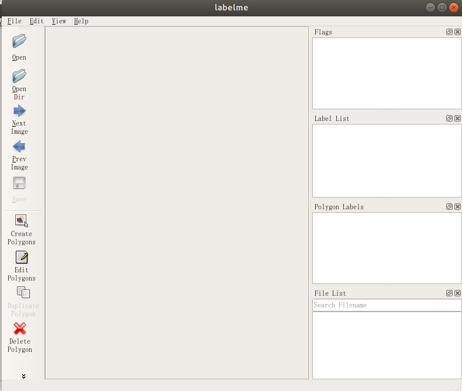
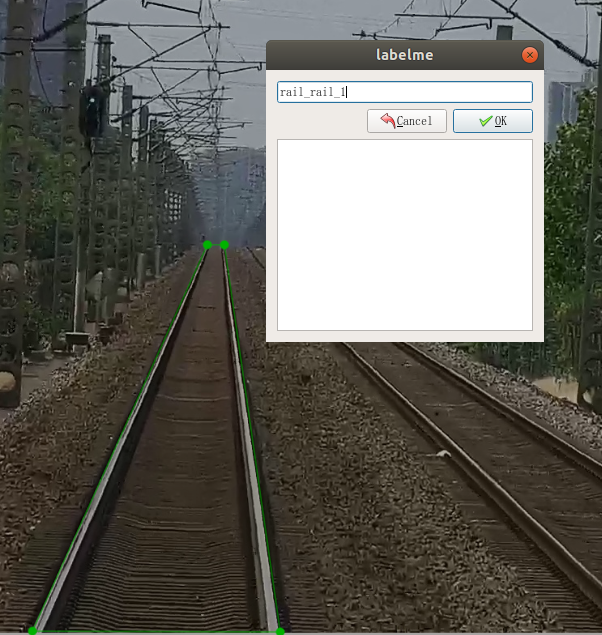

# 图片分割标注工具labelme的使用

## 1. labelme的安装

*labelme的使用依赖PyQT5, 所以建议在Python3中安装使用*

* pip install pyqt5
* pip install labelme

然后在命令行输入*labelme*即可打开如下界面:

## 2.labelme使用

* 点击左侧Open Dir选择需要标注的数据集

* 点击左侧Create Polygons,鼠标变为十字形状,并在图片中标出列车即将行驶的区域,一定要标注为封闭区域,如下图所示

  

* 封闭区域标注完毕后会弹出label选择框,如果是第一次,需要手动输入标签,根据coco数据集的标签命名规则,此处输入rail_rail_1
* 点击左侧Save按钮,保存当前标注,默认保存为json格式
* 点击左侧Next Image并重复以上步骤,直到标注完成所有图片

## 3.labelme标注格式转标准coco数据集格式

### 请将*labelme2COCO.py*文件拷贝至labelme标注工具产生的json格式标注文件夹下,打开命令行执行:

python labelme2COCO.py

等待一段时间之后,会在当前文件夹下生成new.json文件,该文件即为标准coco数据集格式的json文件,使用Detectron进行训练时需要用到该文件.

